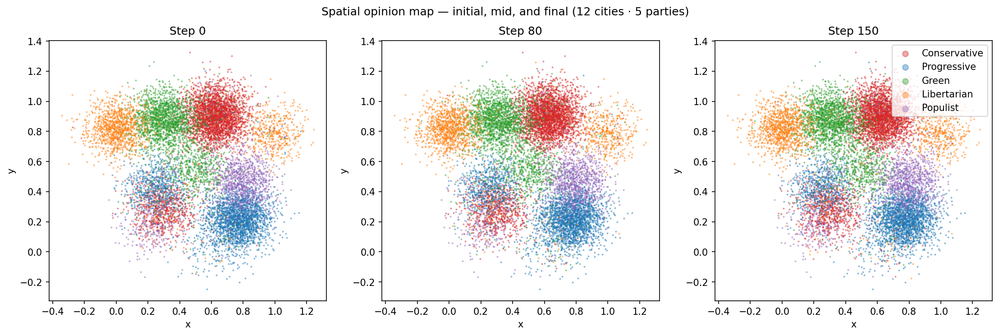
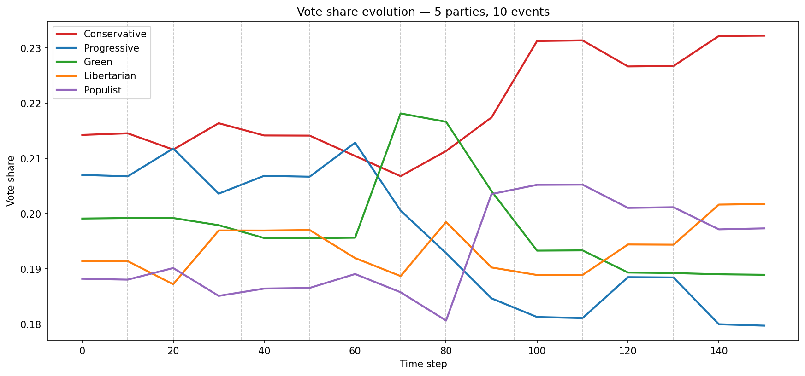
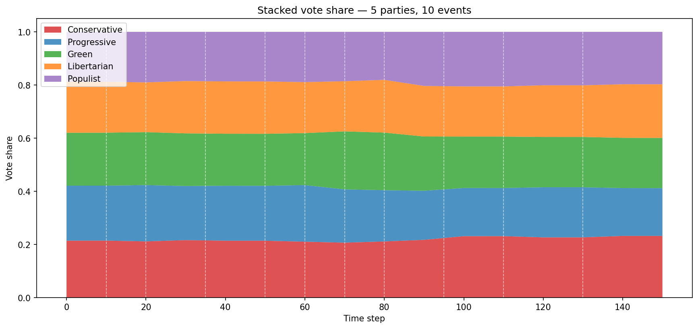
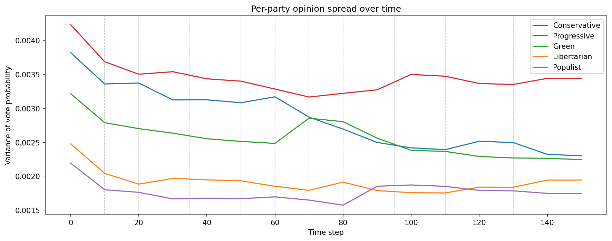
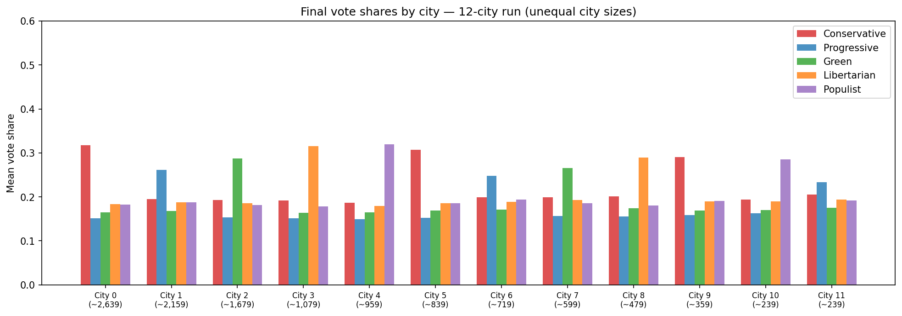
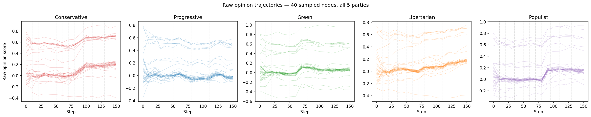

# Opinion Inflection

A large-scale agent-based simulator of opinion dynamics and voting intentions.
Models how opinions evolve in a community through peer influence and real-world
shocks, using a sparse directed network of up to 10 000+ nodes.

---

## Overview

Opinion Inflection combines three classic ideas from computational social science
into a single, vectorised Python framework:

| Mechanism | Source model | What it captures |
|---|---|---|
| Peer influence | DeGroot averaging | Neighbours pull opinions toward their own |
| Bounded confidence | Deffuant model | Nodes only listen to neighbours within an opinion-distance threshold |
| Platform-driven events | Custom attribute-mediated model | Real-world shocks shift voter attributes; parties gain or lose support based on how their platform aligns with those shifts — no party ever hard-codes which events benefit it |

Each node carries a socio-demographic attribute profile (health, wealth, family
status, education, age, credulity, charisma). Opinions are raw scores over
*P* parties; vote probabilities are derived via softmax. Influencers emerge
naturally — they are not hard-coded — from the interaction of high charisma,
low credulity, and high network connectivity.

---

## Gallery

### Vote share evolution — annotated events

Cities start with different partisan leans (Conservative leads with two
Conservative-leaning cities). The three vertical dashed lines mark the events:

- **Step 30 — Economic recession** (`capital` falls): nodes become poorer →
  Progressive (platform: appeals to low-capital voters) gains; Conservative loses.
- **Step 50 — Pro-family campaign** (`family_status` rises): family-values salience
  increases → Conservative (platform: appeals to high-family voters) gains; Green loses.
- **Step 70 — Healthcare crisis** (`health_status` falls): health deteriorates →
  Green (platform: appeals to health-concerned voters) gains; Progressive loses slightly.

None of these beneficiaries are specified in the events. They emerge from each
party's platform alignment with the attribute change.


---

### Spatial opinion map — before and after

10 000 nodes in five city clusters, each given a distinct initial partisan lean.
Each dot is coloured by the party it is most likely to vote for. After 100 steps,
peer influence within the bounded-confidence band sharpens the cluster boundaries.


---

### Effect of the bounded-confidence threshold ε

With `ε = 0.40` (left), within-city peer influence is strong and nodes converge
quickly to a city-level consensus, producing solid coloured blobs. With `ε = 0.15`
(right), even within-city nodes are often too far apart to interact, so opinions
remain more dispersed.


---

### Polarisation index over time

With the default wide threshold (`ε = 0.40`) all nodes can interact with most of
their neighbours, so the population rapidly converges to a party-indifferent
consensus and the polarisation index collapses toward zero. A tight threshold
(`ε = 0.15`) prevents this global averaging: nodes only interact within narrow
opinion bands, so local blocs crystallise and the population retains a
polarisation level roughly 5× higher than the converged default.


---

### Vote share stacked area — default run

Stacked area chart produced by `plot_vote_share_evolution`. Each band is one
party; the total always sums to 1.


---

### Raw opinion trajectories — 80 sampled nodes

Each line is one node's raw score for Conservative over 100 steps. Two visible
streams emerge from the city biases — nodes in Conservative-leaning cities (upper
band) and nodes in other cities (lower band). Peer influence within each city
draws the streams inward during steps 0–30. At **step 50** the pro-family campaign
raises `family_status`, which aligns strongly with Conservative's platform, lifting
the upper stream sharply. The lower stream is largely unaffected. The vertical
dashed lines mark all three events.


---

### Opinion score distribution snapshots

Histogram of raw scores for the Conservative party at five evenly-spaced
snapshots. The distribution tightens and shifts over time as peer influence and
events reshape the population.


---

### Node attribute prior distributions

All seven attributes are drawn independently from Beta distributions at
initialisation. `capital` and `charisma` are right-skewed (most nodes are
ordinary); `credulity` is roughly symmetric around 0.5.


---

## Gallery — extended run (12 cities · 5 parties · 10 events)

The scenarios below use 15 000 nodes distributed across **12 cities** of
varying population sizes, **5 parties**, and **10 staggered events** spanning
the full 150-step simulation.

Each party's platform determines which events benefit it:

| Party | Key platform weights |
|---|---|
| Conservative | `family_status` +8, `age` +5, `capital` +4 |
| Progressive | `capital` −7, `education` +5 |
| Green | `health_status` −6, `age` −4 |
| Libertarian | `capital` +6, `education` +4 |
| Populist | `credulity` +7, `family_status` +4, `capital` −3 |

Events fired (in order), with the attribute change and which party benefits:

| Step | Event | Attribute delta | Benefits |
|---|---|---|---|
| 10 | Recession shock | `capital` −0.15 | Progressive, Populist |
| 20 | Tax-cut campaign | `capital` +0.10, `education` +0.05 | Libertarian, Conservative |
| 35 | Green climate bill | `health_status` +0.05, `age` −0.03 | Green |
| 50 | Progressive housing plan | `capital` −0.05 | Progressive, Populist |
| 60 | Health system crisis | `health_status` −0.20 | Green |
| 70 | Libertarian deregulation | `capital` +0.08, `education` +0.04 | Libertarian |
| 80 | Populist anti-elite surge | `credulity` +0.10, `family_status` +0.05 | Populist, Conservative |
| 95 | Conservative security push | `age` +0.05, `family_status` +0.06 | Conservative |
| 110 | Education reform | `education` +0.10 | Progressive, Libertarian |
| 130 | Late economic recovery | `capital` +0.10 | Libertarian, Conservative |

---

### Spatial opinion map — initial, mid, and final

Each dot is one node, coloured by its leading party. Over 150 steps the
city clusters develop distinct partisan identities as peer influence and
events reshape the landscape.



---

### Vote share evolution — 5 parties, 10 events

Line chart of aggregate vote shares. Every dashed vertical line marks one
event; parties respond according to their platform alignment with the
attribute change — no event specifies a beneficiary.



---

### Stacked vote-share area chart

The same data as above rendered as a stacked area — useful for seeing how
total shares redistribute after each shock.



---

### Per-party opinion spread over time

Variance of each party's vote-probability column across all nodes.
Events that strongly align with a party's platform cause a spike in that
party's spread as opinion shifts become concentrated.



---

### Final vote shares by city

Bar chart of mean vote shares per city at step 150. Cities were initialised
with distinct partisan leans and are relatively isolated from one another
(low inter-city edge density), so each develops its own dominant party
rather than converging to the global mean.



---

### Opinion trajectories — all 5 parties

Raw opinion score traces for 40 randomly sampled nodes, one panel per
party. City biases create initial streams within each panel; events shift
the streams according to platform alignment.



---

## Features

- **Multi-party** — any number of parties *P*, each with its own platform
- **Large-scale** — 10 000+ nodes via `scipy.sparse` CSR matrices throughout
- **Spatial city clusters** — configurable number of cities with intra- and inter-city
  edge densities; 2D positions stored for visualisation
- **City partisan leans** — optional per-city opinion biases give each cluster a
  distinct starting identity
- **Attribute-driven susceptibility** — peer influence and message receptivity scale
  with each node's attribute profile
- **Charisma-scaled influence** — outgoing edge weights are multiplied by the sender's
  charisma at runtime; the weight matrix itself is never mutated
- **Platform-driven events** — `ExternalEvent` describes only real-world attribute
  changes (`attribute_deltas`) and which nodes are susceptible (`attribute_appeal`).
  Which party gains or loses support emerges automatically from each `Party`'s
  platform alignment: `Δopinion[i,p] = (platform·Δattrs) × (appeal·attrs[i]) × receptivity[i]`
- **Synchronous vectorised updates** — all four phases (attribute deltas → message
  nudges → peer influence → noise) are computed from time-*t* values before writing,
  giving reproducible, parallelism-friendly dynamics
- **Analysis and plotting** — vote-share stacked area chart, per-node opinion
  trajectories, 2D spatial opinion map, and opinion histograms

---

## Installation

```bash
pip install -r requirements.txt
```

Requires Python 3.10+.

**Dependencies**

| Package | Purpose |
|---|---|
| `numpy >= 1.24` | Array operations, RNG |
| `scipy >= 1.10` | Sparse matrices, softmax |
| `matplotlib >= 3.7` | Plotting |
| `pandas >= 2.0` | Vote-share time series export |

---

## Quick Start

```bash
python examples/basic_run.py
```

This runs a 10 000-node, 3-party, 5-city simulation for 100 steps with three
scheduled events (economic recession, pro-family campaign, healthcare crisis)
and saves four PNG plots to the current directory.

---

## Project Structure

```
opinion_inflection/
├── config.py               # SimConfig dataclass — all parameters in one place
├── requirements.txt
├── opsim/
│   ├── __init__.py
│   ├── node.py             # Attribute & opinion array initialisation
│   ├── network.py          # Spatial 2D city-cluster graph (sparse)
│   ├── events.py           # Party, ExternalEvent & EventSchedule
│   ├── dynamics.py         # Vectorised per-step update
│   ├── simulation.py       # Simulation engine + history recording
│   └── analysis.py         # Vote prediction, polarisation metrics, plots
├── examples/
│   ├── basic_run.py              # End-to-end 3-party demo
│   ├── regenerate_basic_plots.py # Regenerate 3-party gallery images
│   └── regenerate_fixed_plots.py # Regenerate polarisation + 5-party images
└── tests/
    ├── test_node.py
    ├── test_dynamics.py
    └── test_simulation.py
```

---

## Configuration

All parameters are collected in `config.py`:

```python
from config import SimConfig
from opsim.events import Party

parties = [
    Party("Conservative", platform={"family_status": +8.0, "capital": +5.0, "age": +3.0}),
    Party("Progressive",  platform={"capital": -7.0, "education": +4.0}),
    Party("Green",        platform={"health_status": -6.0, "age": -3.0}),
]

config = SimConfig(
    n_nodes=10_000,
    n_parties=3,
    n_cities=5,
    city_sizes=[0.30, 0.25, 0.20, 0.15, 0.10],
    city_radius=0.1,
    intra_city_density=0.005,
    inter_city_density=0.0005,
    confidence_threshold=0.4,   # bounded-confidence ε
    noise_std=0.01,
    n_steps=100,
    history_interval=1,
    random_seed=42,
    parties=parties,
    city_opinion_biases=[        # give each cluster a distinct starting lean
        (0, 0.6),  # city 0 → Conservative
        (1, 0.6),  # city 1 → Progressive
        (2, 0.6),  # city 2 → Green
        (0, 0.4),  # city 3 → Conservative (secondary)
        (1, 0.4),  # city 4 → Progressive  (secondary)
    ],
)
```

### Node attribute distributions

Each attribute is drawn from a Beta distribution. Defaults:

| Attribute | Beta(α, β) | Meaning |
|---|---|---|
| `health_status` | Beta(2, 2) | Physical/mental health |
| `capital` | Beta(2, 5) | Wealth / income (right-skewed) |
| `family_status` | Beta(2, 3) | Family size / dependents |
| `education` | Beta(2, 3) | Education level |
| `age` | Beta(2, 2) | Normalised age |
| `credulity` | Beta(3, 3) | Susceptibility to peers and messages |
| `charisma` | Beta(2, 5) | Outgoing influence power (right-skewed) |

Override via `attribute_distributions` in `SimConfig`.

### Susceptibility function

Peer susceptibility is a linear combination of attributes, clipped to [0, 1]:

```
susceptibility[i] = clip(0.5 − 0.05·health − 0.15·capital + 0.10·family
                         − 0.10·education − 0.05·age + 0.30·credulity, 0, 1)
```

Weights are configurable via `susceptibility_weights` in `SimConfig`.

---

## Parties and Events

### Defining parties

```python
from opsim.events import Party

# Positive weight → party appeals to voters HIGH in that attribute
# Negative weight → party appeals to voters LOW in that attribute
conservative = Party(
    name="Conservative",
    platform={
        "family_status": +8.0,   # appeals to family-values voters
        "capital":       +5.0,   # appeals to wealthier voters
        "age":           +3.0,   # appeals to older voters
    },
)
```

### Defining events

```python
from opsim.events import ExternalEvent, EventSchedule

# Events describe real-world changes only.
# Which party benefits is never specified — it emerges from platform alignment.
recession = ExternalEvent(
    name="Economic recession",
    time_step=30,
    strength=0.7,            # overall event intensity [0, 1]
    effectiveness=0.6,       # how salient the event is [0, 1]
    attribute_appeal={"capital": 0.8},       # capital-sensitive nodes react most
    attribute_deltas={"capital": -0.15},     # capital falls for affected nodes
)
# → Progressive (platform capital: -7.0) gains: (-7.0) × (-0.15) = +1.05
# → Conservative (platform capital: +5.0) loses: (+5.0) × (-0.15) = -0.75

schedule = EventSchedule([recession, ...])
```

**How the opinion nudge is computed for each node *i* and party *p*:**

```
platform_gain  = party_p.platform · event.attribute_deltas   (scalar)
node_resonance = event.attribute_appeal · attributes[i]       (scalar)
receptivity    = credulity[i] × strength × effectiveness      (scalar)

Δopinion[i, p] = platform_gain × node_resonance × receptivity
```

`platform_gain` captures how much the world change aligns with party *p*'s
platform; `node_resonance` captures which nodes are most attentive to the
event; `receptivity` captures individual susceptibility.

---

## Running a Custom Simulation

```python
from config import SimConfig
from opsim.events import ExternalEvent, EventSchedule, Party
from opsim.simulation import Simulation
from opsim.analysis import predict_vote, compute_polarization, plot_vote_share_evolution

parties = [
    Party("A", platform={"education": +5.0, "capital": -3.0}),
    Party("B", platform={"capital": +5.0, "age": +3.0}),
    Party("C", platform={"health_status": -4.0, "age": -3.0}),
    Party("D", platform={"credulity": +6.0, "family_status": +4.0}),
]

config = SimConfig(n_nodes=5_000, n_parties=4, n_steps=200, random_seed=0,
                   parties=parties)

events = EventSchedule([
    ExternalEvent(
        name="Education reform",
        time_step=80,
        strength=0.6,
        effectiveness=0.9,
        attribute_appeal={"education": 1.0},
        attribute_deltas={"education": +0.10},   # education rises → Party A gains
    )
])

sim = Simulation(config, events)
sim.run()

shares = predict_vote(sim.opinion_history[-1])
print(shares)  # e.g. [0.28, 0.31, 0.24, 0.17]

fig = plot_vote_share_evolution(sim, party_names=["A", "B", "C", "D"])
fig.savefig("shares.png")
```

---

## Analysis API

| Function | Returns | Description |
|---|---|---|
| `predict_vote(opinions)` | `(P,)` | Aggregate softmax vote shares |
| `node_vote_probabilities(opinions)` | `(N, P)` | Per-node softmax probabilities |
| `compute_polarization(opinions)` | `float` | Mean per-node opinion variance |
| `plot_vote_share_evolution(sim)` | `Figure` | Stacked area chart over time |
| `plot_opinion_trajectories(sim, party_index)` | `Figure` | Raw score traces for sampled nodes |
| `plot_spatial_opinions(sim, t_index)` | `Figure` | 2D map coloured by leading party |
| `plot_opinion_histogram(sim, party_index)` | `Figure` | Distribution snapshots at multiple steps |

Export the vote-share time series to a DataFrame:

```python
df = sim.to_dataframe(party_names=["Conservative", "Progressive", "Green"])
df.to_csv("results.csv", index=False)
```

---

## How Opinion Dynamics Work

Each simulation step has four synchronous phases (computed from time-*t* values
before writing):

1. **Attribute deltas** — event shocks modify `attributes` in-place and clamp to [0, 1].
   Derived quantities (susceptibility, receptivity) are recomputed.

2. **Message nudges** — for each event, the opinion update for party *p* at node *i* is:

   ```
   Δopinion[i, p] = (party_p.platform · event.delta_attrs)
                    × (event.appeal · attrs[i])
                    × credulity[i] × strength × effectiveness
   ```

   The first factor is a scalar per party (how aligned the world change is with
   that party's platform). The second and third are per-node (how susceptible this
   node is to this event). No party ever specifies which events benefit it.

3. **Peer influence (bounded confidence)** — the effective weight matrix
   `W_eff[i,j] = W_base[i,j] × charisma[i]` is built; edges where the Euclidean
   opinion-vector distance exceeds `confidence_threshold` ε are zeroed out. The
   remaining weighted opinion differences are accumulated per receiver and scaled by
   `susceptibility`.

4. **Noise** — Gaussian noise with `noise_std` is added to every opinion entry.

### Emergent influencers

No node is labelled an "influencer". High-charisma, low-credulity, high-out-degree hub
nodes naturally become opinion leaders: their outgoing edge weights are amplified,
they resist being swayed themselves, and many neighbours receive their signal.

---

## Tests

```bash
pytest tests/
```

The test suite covers:

- Attribute initialisation shape and value ranges
- Susceptibility and receptivity derivations
- Platform-driven nudge: family-values party gains more from a family-status event for
  high-family-status nodes than for low-family-status nodes
- High-credulity nodes shift more than low-credulity nodes under the same event
- Bounded confidence: opinions beyond ε receive zero peer influence
- 2-node convergence
- `predict_vote` sums to 1.0
- Full simulation round-trip without errors

---

## Limitations

This is a qualitative *what-if* exploration tool, not a forecasting model:

- **Reductive attribute model** — seven attributes are a coarse approximation of human
  decision-making
- **Linear platform model** — party appeal is a simple dot product; real voter–party
  alignment is non-linear and context-dependent
- **Hard bounded confidence** — creates sharper opinion clusters than a smooth decay
  kernel would
- **Assumed topology** — imposed city-cluster structure; real networks include workplace,
  family, and online ties
- **No calibration** — parameters are hand-tuned assumptions
- **No cognitive biases** — no confirmation bias, motivated reasoning, or framing effects
  beyond credulity
- **Static network** — no homophily-driven rewiring over time
- **Synchronous updates** — unrealistic but reproducible and amenable to vectorisation
- **Exogenous events** — real events are partly shaped by public opinion
- **Independent party scores** — no strategic voting, ranked-choice dynamics, or
  coalition effects
- **Static credulity** — in reality, trust in sources changes with experience
