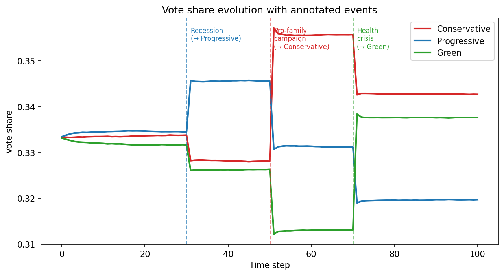
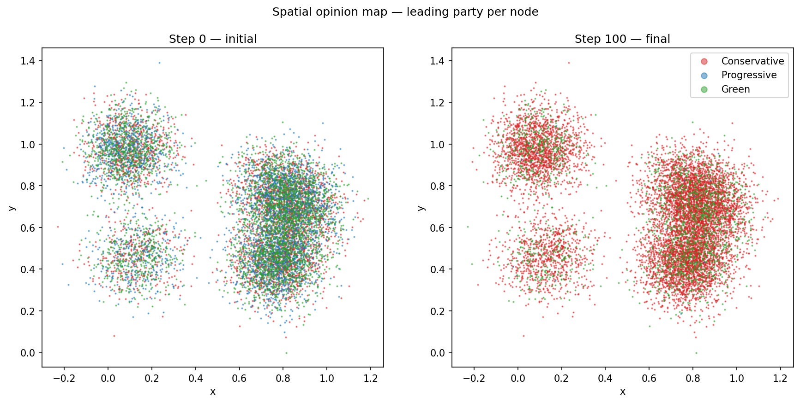
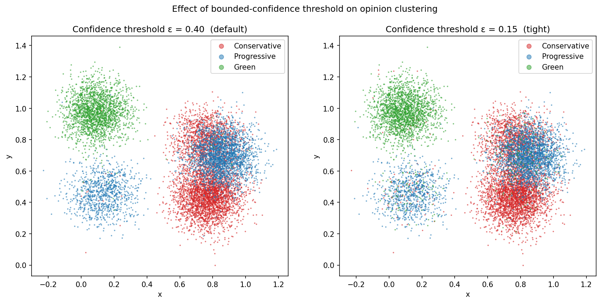
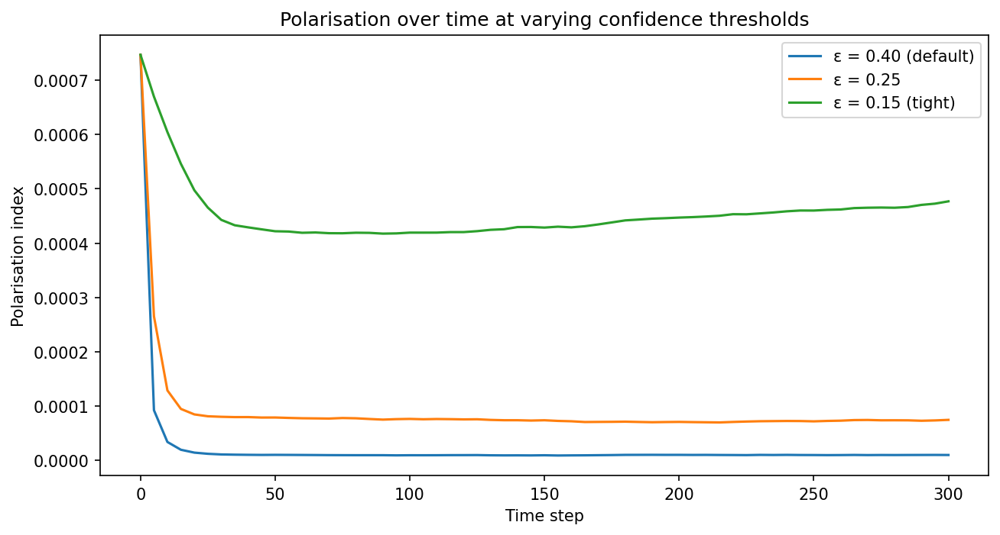
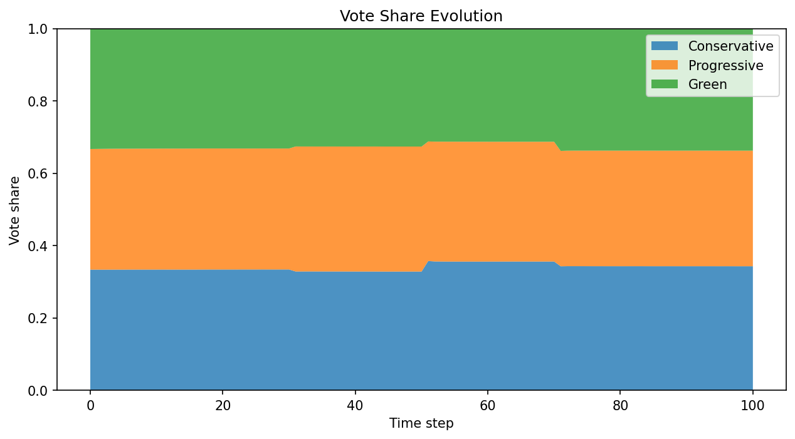
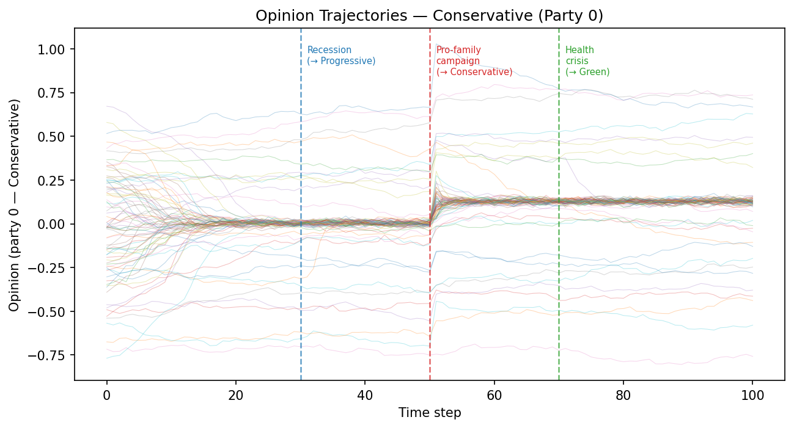
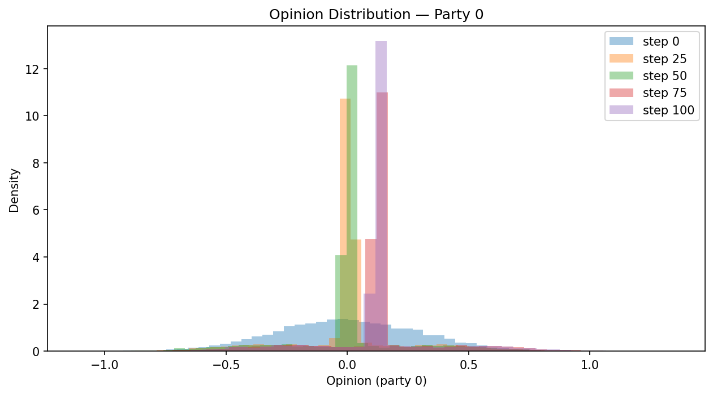
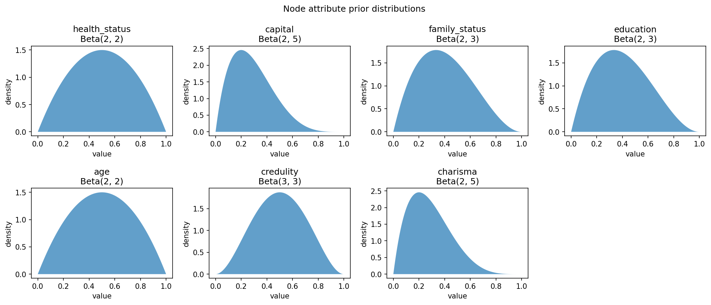

# Opinion Inflection

A large-scale agent-based simulator of opinion dynamics and voting intentions.
Models how opinions evolve in a community through peer influence and targeted
external messaging, using a sparse directed network of up to 10 000+ nodes.

---

## Overview

Opinion Inflection combines three classic ideas from computational social science
into a single, vectorised Python framework:

| Mechanism | Source model | What it captures |
|---|---|---|
| Peer influence | DeGroot averaging | Neighbours pull opinions toward their own |
| Bounded confidence | Deffuant model | Nodes only listen to neighbours within an opinion-distance threshold |
| Targeted messaging | Custom attribute-mediated model | Party campaigns and real-world shocks nudge voters whose profiles match the message |

Each node carries a socio-demographic attribute profile (health, wealth, family
status, education, age, credulity, charisma). Opinions are raw scores over
*P* parties; vote probabilities are derived via softmax. Influencers emerge
naturally — they are not hard-coded — from the interaction of high charisma,
low credulity, and high network connectivity.

---

## Gallery

### Vote share evolution — annotated events

The three vertical dashed lines mark the economic recession (step 30), the
pro-family campaign (step 50), and the healthcare crisis (step 70). Each event
shifts the corresponding party's trajectory.



---

### Spatial opinion map — before and after

10 000 nodes placed in five city clusters. Each dot is coloured by the party
it is most likely to vote for. After 100 steps, party boundaries sharpen
around the clusters.



---

### Effect of the bounded-confidence threshold ε

Lowering ε (from 0.40 to 0.15) makes nodes ignore anyone whose opinions differ
too much, driving the population into tighter ideological bubbles.



---

### Polarisation index over time

At a tight threshold (ε = 0.15) the community rapidly fragments into
entrenched blocs. At the default (ε = 0.40) opinion diversity is largely
preserved.



---

### Vote share stacked area — default run

Stacked area chart produced by `plot_vote_share_evolution`. Each band is one
party; the total always sums to 1.



---

### Raw opinion trajectories — 80 sampled nodes

Each line is one node's raw score for the Conservative party over 100 steps.
The spread gradually narrows as peer influence pulls outliers toward the crowd.



---

### Opinion score distribution snapshots

Histogram of raw scores for the Conservative party at five evenly-spaced
snapshots. The distribution tightens over time as the simulation converges.



---

### Node attribute prior distributions

All seven attributes are drawn independently from Beta distributions at
initialisation. `capital` and `charisma` are right-skewed (most nodes are
ordinary); `credulity` is roughly symmetric around 0.5.



---

## Features

- **Multi-party** — any number of parties *P*
- **Large-scale** — 10 000+ nodes via `scipy.sparse` CSR matrices throughout
- **Spatial city clusters** — configurable number of cities with intra- and inter-city
  edge densities; 2D positions stored for visualisation
- **Attribute-driven susceptibility** — peer influence and message receptivity scale
  with each node's attribute profile
- **Charisma-scaled influence** — outgoing edge weights are multiplied by the sender's
  charisma at runtime; the weight matrix itself is never mutated
- **Targeted external events** — each `ExternalEvent` carries an `attribute_appeal`
  vector (who resonates with it), `strength` / `effectiveness` scalars, optional
  `attribute_deltas` (e.g. an economic shock that directly reduces `capital`), and an
  optional `target_filter` predicate
- **Synchronous vectorised updates** — all four phases (attribute deltas → message
  nudges → peer influence → noise) are computed from time-*t* values before writing,
  giving reproducible, parallelism-friendly dynamics
- **Analysis and plotting** — vote-share stacked area chart, per-node opinion
  trajectories, 2D spatial opinion map, and opinion histograms

---

## Installation

```bash
pip install -r requirements.txt
```

Requires Python 3.10+.

**Dependencies**

| Package | Purpose |
|---|---|
| `numpy >= 1.24` | Array operations, RNG |
| `scipy >= 1.10` | Sparse matrices, softmax |
| `matplotlib >= 3.7` | Plotting |
| `pandas >= 2.0` | Vote-share time series export |

---

## Quick Start

```bash
python examples/basic_run.py
```

This runs a 10 000-node, 3-party, 5-city simulation for 100 steps with three
scheduled events (economic recession, pro-family campaign, healthcare crisis)
and saves four PNG plots to the current directory.

---

## Project Structure

```
opinion_inflection/
├── config.py               # SimConfig dataclass — all parameters in one place
├── requirements.txt
├── assets/                 # Generated plots (README illustrations)
├── opsim/
│   ├── __init__.py
│   ├── node.py             # Attribute & opinion array initialisation
│   ├── network.py          # Spatial 2D city-cluster graph (sparse)
│   ├── events.py           # ExternalEvent & EventSchedule
│   ├── dynamics.py         # Vectorised per-step update
│   ├── simulation.py       # Simulation engine + history recording
│   └── analysis.py         # Vote prediction, polarisation metrics, plots
├── examples/
│   └── basic_run.py        # End-to-end demo
└── tests/
    ├── test_node.py
    ├── test_dynamics.py
    └── test_simulation.py
```

---

## Configuration

All parameters are collected in `config.py`:

```python
from config import SimConfig

config = SimConfig(
    n_nodes=10_000,
    n_parties=3,
    n_cities=5,
    city_sizes=[0.30, 0.25, 0.20, 0.15, 0.10],  # relative; normalised internally
    city_radius=0.1,
    intra_city_density=0.005,
    inter_city_density=0.0005,
    confidence_threshold=0.4,   # bounded-confidence ε
    noise_std=0.01,
    n_steps=100,
    history_interval=1,
    random_seed=42,
)
```

### Node attribute distributions

Each attribute is drawn from a Beta distribution. Defaults:

| Attribute | Beta(α, β) | Meaning |
|---|---|---|
| `health_status` | Beta(2, 2) | Physical/mental health |
| `capital` | Beta(2, 5) | Wealth / income (right-skewed) |
| `family_status` | Beta(2, 3) | Family size / dependents |
| `education` | Beta(2, 3) | Education level |
| `age` | Beta(2, 2) | Normalised age |
| `credulity` | Beta(3, 3) | Susceptibility to peers and messages |
| `charisma` | Beta(2, 5) | Outgoing influence power (right-skewed) |

Override via `attribute_distributions` in `SimConfig`.

### Susceptibility function

Peer susceptibility is a linear combination of attributes, clipped to [0, 1]:

```
susceptibility[i] = clip(0.5 − 0.05·health − 0.15·capital + 0.10·family
                         − 0.10·education − 0.05·age + 0.30·credulity, 0, 1)
```

Weights are configurable via `susceptibility_weights` in `SimConfig`.

---

## External Events

```python
from opsim.events import ExternalEvent, EventSchedule

recession = ExternalEvent(
    name="Economic recession",
    time_step=30,
    party_index=1,           # which party benefits
    strength=0.7,            # message budget [0, 1]
    effectiveness=0.6,       # message quality [0, 1]
    attribute_appeal={"capital": 0.8, "family_status": 0.3},
    attribute_deltas={"capital": -0.15},   # direct shock to attributes
)

schedule = EventSchedule([recession, ...])
```

**How a message affects node *i*:**

```
relevance_i    = attribute_appeal · attributes[i]     (dot product)
receptivity_i  = credulity[i] × strength × effectiveness
opinion_delta  = relevance_i × receptivity_i
opinions[i, party_index] += opinion_delta
```

A well-off, high-credulity node resonating with a high-budget campaign shifts
substantially; a sceptical or non-matching node barely moves.

Non-partisan shocks (e.g. a natural disaster) can omit `party_index` and only
supply `attribute_deltas` to model real-world attribute changes without a direct
opinion nudge.

---

## Running a Custom Simulation

```python
from config import SimConfig
from opsim.events import ExternalEvent, EventSchedule
from opsim.simulation import Simulation
from opsim.analysis import predict_vote, compute_polarization, plot_vote_share_evolution

config = SimConfig(n_nodes=5_000, n_parties=4, n_steps=200, random_seed=0)

events = EventSchedule([
    ExternalEvent(
        name="Education reform",
        time_step=80,
        party_index=2,
        strength=0.6,
        effectiveness=0.9,
        attribute_appeal={"education": 1.0},
    )
])

sim = Simulation(config, events)
sim.run()

shares = predict_vote(sim.opinion_history[-1])
print(shares)  # e.g. [0.28, 0.31, 0.24, 0.17]

fig = plot_vote_share_evolution(sim, party_names=["A", "B", "C", "D"])
fig.savefig("shares.png")
```

---

## Analysis API

| Function | Returns | Description |
|---|---|---|
| `predict_vote(opinions)` | `(P,)` | Aggregate softmax vote shares |
| `node_vote_probabilities(opinions)` | `(N, P)` | Per-node softmax probabilities |
| `compute_polarization(opinions)` | `float` | Mean per-node opinion variance |
| `plot_vote_share_evolution(sim)` | `Figure` | Stacked area chart over time |
| `plot_opinion_trajectories(sim, party_index)` | `Figure` | Raw score traces for sampled nodes |
| `plot_spatial_opinions(sim, t_index)` | `Figure` | 2D map coloured by leading party |
| `plot_opinion_histogram(sim, party_index)` | `Figure` | Distribution snapshots at multiple steps |

Export the vote-share time series to a DataFrame:

```python
df = sim.to_dataframe(party_names=["Conservative", "Progressive", "Green"])
df.to_csv("results.csv", index=False)
```

---

## How Opinion Dynamics Work

Each simulation step has four synchronous phases (computed from time-*t* values
before writing):

1. **Attribute deltas** — event shocks modify `attributes` in-place and clamp to [0, 1].
   Derived quantities (susceptibility, receptivity) are recomputed.

2. **Message nudges** — for each partisan event, a relevance score is computed per node
   via the dot product of `attribute_appeal` and the node's attribute vector, then scaled
   by credulity × strength × effectiveness and added to the target party's opinion column.

3. **Peer influence (bounded confidence)** — the effective weight matrix
   `W_eff[i,j] = W_base[i,j] × charisma[i]` is built; edges where the Euclidean
   opinion-vector distance exceeds `confidence_threshold` ε are zeroed out. The
   remaining weighted opinion differences are accumulated per receiver and scaled by
   `susceptibility`.

4. **Noise** — Gaussian noise with `noise_std` is added to every opinion entry.

### Emergent influencers

No node is labelled an "influencer". High-charisma, low-credulity, high-out-degree hub
nodes naturally become opinion leaders: their outgoing edge weights are amplified,
they resist being swayed themselves, and many neighbours receive their signal.

---

## Tests

```bash
pytest tests/
```

The test suite covers:

- Attribute initialisation shape and value ranges
- Susceptibility and receptivity derivations
- Message nudge: high-family-status nodes shift more than low-family-status nodes
- High-credulity nodes shift more than low-credulity nodes under the same message
- Bounded confidence: opinions beyond ε receive zero peer influence
- 2-node convergence
- `predict_vote` sums to 1.0
- Full simulation round-trip without errors

---

## Limitations

This is a qualitative *what-if* exploration tool, not a forecasting model:

- **Reductive attribute model** — seven attributes are a coarse approximation of human
  decision-making
- **Hard bounded confidence** — creates sharper opinion clusters than a smooth decay
  kernel would
- **Assumed topology** — imposed city-cluster structure; real networks include workplace,
  family, and online ties
- **No calibration** — parameters are hand-tuned assumptions
- **No cognitive biases** — no confirmation bias, motivated reasoning, or framing effects
  beyond credulity
- **Static network** — no homophily-driven rewiring over time
- **Synchronous updates** — unrealistic but reproducible and amenable to vectorisation
- **Exogenous events** — real events are partly shaped by public opinion
- **Independent party scores** — no strategic voting, ranked-choice dynamics, or
  coalition effects
- **Static credulity** — in reality, trust in sources changes with experience
